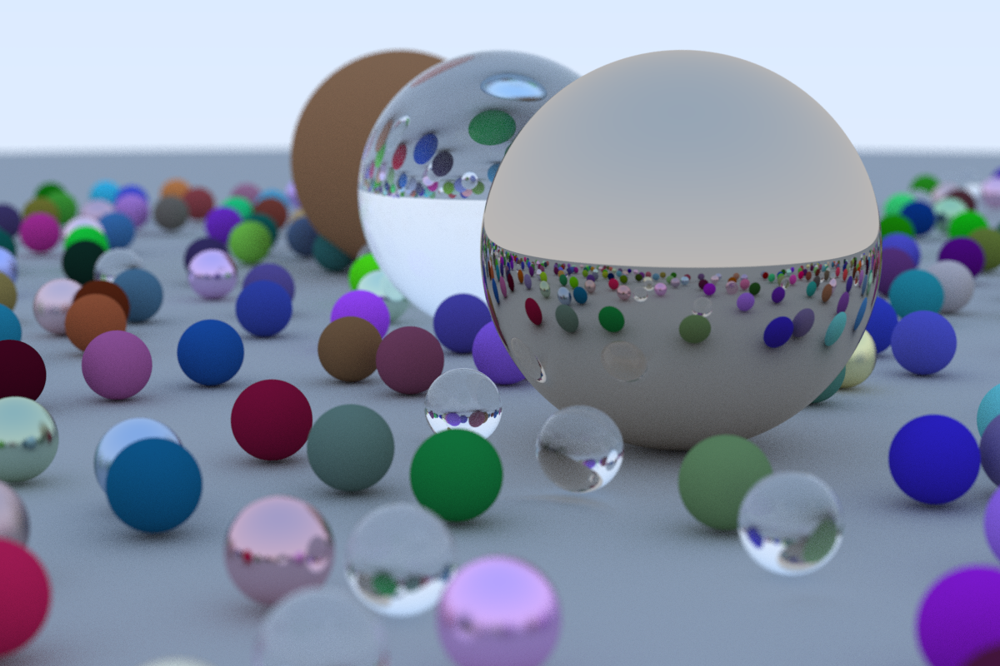

# Ray Tracing in One Weekend (Written in Rust)

Implementation of the Ray Tracing in One Weekend tutorial in Rust: https://raytracing.github.io/books/RayTracingInOneWeekend.html

I've used Rayon to parallelize the rows of the image being rendered, which helped speed up rendering a great deal:

```
  ~/Projects/rust-ray-tracing   main ±  time cargo run --release
    Finished release [optimized] target(s) in 0.01s
     Running `target/release/rust_ray_tracing`
Rendering image with resolution of 1200x800:
Done rendering, writing to file now:
Done!
cargo run --release  791.59s user 1.81s system 956% cpu 1:22.98 total
```

The output of the above is a .ppm file that can be converted to a .png with the `convert_to_png.sh` script. Just run the script without arguments to receive the image.

